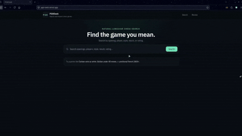

# PGNSeek - Search chess games using natural language



## Features

- Natural language search across chess games (e.g. `aggressive Sicilian white wins 2400+`, `French defense under 30 moves draw`).
- Filter by opening, players, ratings, results, game length and playing style.
- Find games similar to a given game using vector similarity search.
- Opening review: upload your own PGN and get a per-position report of the moves you played, your results, and the engine's best move.

## Architecture Overview

1. **Ingestion:** PGN files are parsed by the ingestion pipeline, features (material swings, sacrifices, endgame entry, a 19-dimensional feature vector, ...) are computed, and games are upserted into **MongoDB Atlas**.
2. **Search:** The FastAPI backend exposes a search API that runs a three-stage query pipeline (token classifier → intent resolver → query builder) and translates the result into a MongoDB filter. Similar games are found via **Atlas Vector Search**.
3. **Opening review:** Uploaded PGNs are stored temporarily in **Supabase Storage** and processed by a **Celery** worker (with **Redis** as broker). Positions are evaluated using the Lichess cloud eval, falling back to a local **Stockfish**, and evaluations are cached in MongoDB.
4. **Frontend:** React + Vite + TypeScript app for searching, viewing games, browsing similar games and running opening reviews.

You can read more about the decisions made [here](DESIGN_DECISIONS.md).

## Prerequisites

1. Python 3.12+ [Download here](https://www.python.org/downloads/)
2. Node.js 22+ [Download here](https://nodejs.org/)
3. Docker Desktop [Download here](https://www.docker.com/products/docker-desktop/)
4. A MongoDB Atlas cluster (required for Vector Search)
5. A Supabase project with a storage bucket (default name: `pgn-uploads`)
6. Stockfish (only needed when running the Celery worker outside Docker; the Docker image installs it)

## Setup

1. Clone the repository: `git clone https://github.com/kakasuarez/PGNSeek.git`.
2. Create the `.env` file and fill in your MongoDB and Supabase credentials: `cp .env.example .env`.
3. Create the vector search index in Atlas. On the `chess_games` collection, create an Atlas Vector Search index named `feature_vector_index` with this definition:
   ```json
   {
     "fields": [
       { "type": "vector", "path": "feature_vector", "numDimensions": 19, "similarity": "cosine" },
       { "type": "filter", "path": "_id" }
     ]
   }
   ```
   The text, TTL and status indexes are created automatically when the backend starts.
4. Create the virtual environment and install dependencies:
   ```
   python3 -m venv backend/venv
   source backend/venv/bin/activate
   pip install -r requirements.txt
   ```
5. Ingest the PGN data. By default, put your PGN files in `data/pgn/`, then run:
   ```
   python pipeline/ingest.py
   ```
   Use `python pipeline/ingest.py --status` to check progress. Interrupted runs resume from where they left off.

## Running

### With Docker (recommended)

```
cd docker
docker compose up -d
```

This starts Redis, the backend (`http://localhost:8000`), the Celery worker and the frontend (`http://localhost:5173`).

For production, use `docker/docker-compose-prod.yml`.

### Locally

1. Start Redis: `cd docker && docker compose up -d redis`.
2. Run the backend (from `backend/`): `uvicorn app.main:app --reload --port 8000`.
3. Run the Celery worker (from `backend/`, with `STOCKFISH_PATH` set in `.env`): `celery -A app.review.tasks.celery_app worker --loglevel=info`.
4. Run the frontend:
   ```
   cd frontend
   cp .env.example .env
   npm install
   npm run dev
   ```

You can try out the APIs in the FastAPI documentation at `http://127.0.0.1:8000/docs`.

## API

| Method | Endpoint                               | Description                                  |
| ------ | -------------------------------------- | -------------------------------------------- |
| GET    | `/health`                              | Liveness check, including DB connection      |
| GET    | `/api/v1/search?q=...`                 | Natural language game search                 |
| GET    | `/api/v1/games/{game_hash}`            | Get a single game                            |
| GET    | `/api/v1/games/{game_hash}/similar`    | Get games similar to the given game          |
| POST   | `/api/v1/review`                       | Submit a PGN file + player name for review   |
| GET    | `/api/v1/review/{job_id}`              | Get the status of a review job               |
| GET    | `/api/v1/review/{job_id}/reports`      | Get the reports of a completed review job    |

## Workflow

1. To clear ingestion state and reprocess every PGN file, run `python pipeline/ingest.py --reset`. Games are keyed by a hash of their content, so re-ingesting does not create duplicates.
2. `scripts/` contains maintenance utilities, e.g. `scripts/delete_last_n_games.py` to trim the `chess_games` collection.
